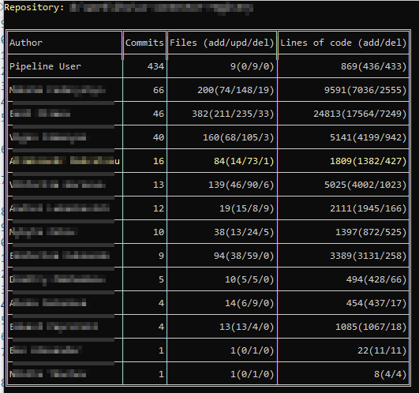
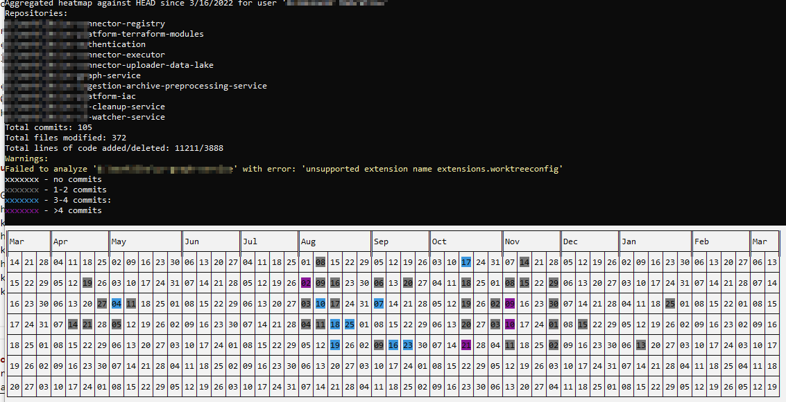

# Intro
Intention of creating this application was a will to get an aggregated statistics from multiple git repos at once.
Most of existing approaches allow to grab it one by one.

Inspired by: 
- https://github.com/casperdcl/git-fame
- https://github.com/arzzen/git-quick-stats
- https://gist.github.com/eyecatchup/3fb7ef0c0cbdb72412fc

# Run
```
Usage: GitHeatmapGenerator [options]

Options:
  -r|--repository <REPOSITORY>  The path to the folder with git repository. Multiple values allowed.
  -u|--user <USER>              Optional. Name of the user to display aggregated statistics. Multiple values allowed.
  -e|--exclude <EXCLUDE>        Optional. Regex for files to ignore during calculations. e.g. '*.md', 'package-lock.json'
  -s|--since <SINCE>            Optional. Date to look commits from. e.g. '2022-12-21', '21-12-2022', 'last-2-month', 'last-10-years'.
  -?|-h|--help                  Show help information.
```


# Sample run
```
GitHeatmapGenerator.exe -u "<user name>" -r "d:\work\xxxxxxxx" -r "d:\work\yyyyyyyyy" --since "last-1-year" --exclude package-lock.json 
```

# Output
Repository stat: 



Aggregated stat:


# Limitations
Preview version of LibGit2Sharp is used because of https://github.com/ryanjon2040/Unreal-Binary-Builder/issues/46 .

Some repositories are not supported because of https://github.com/libgit2/libgit2/issues/6044.

Such repos will be skipped.